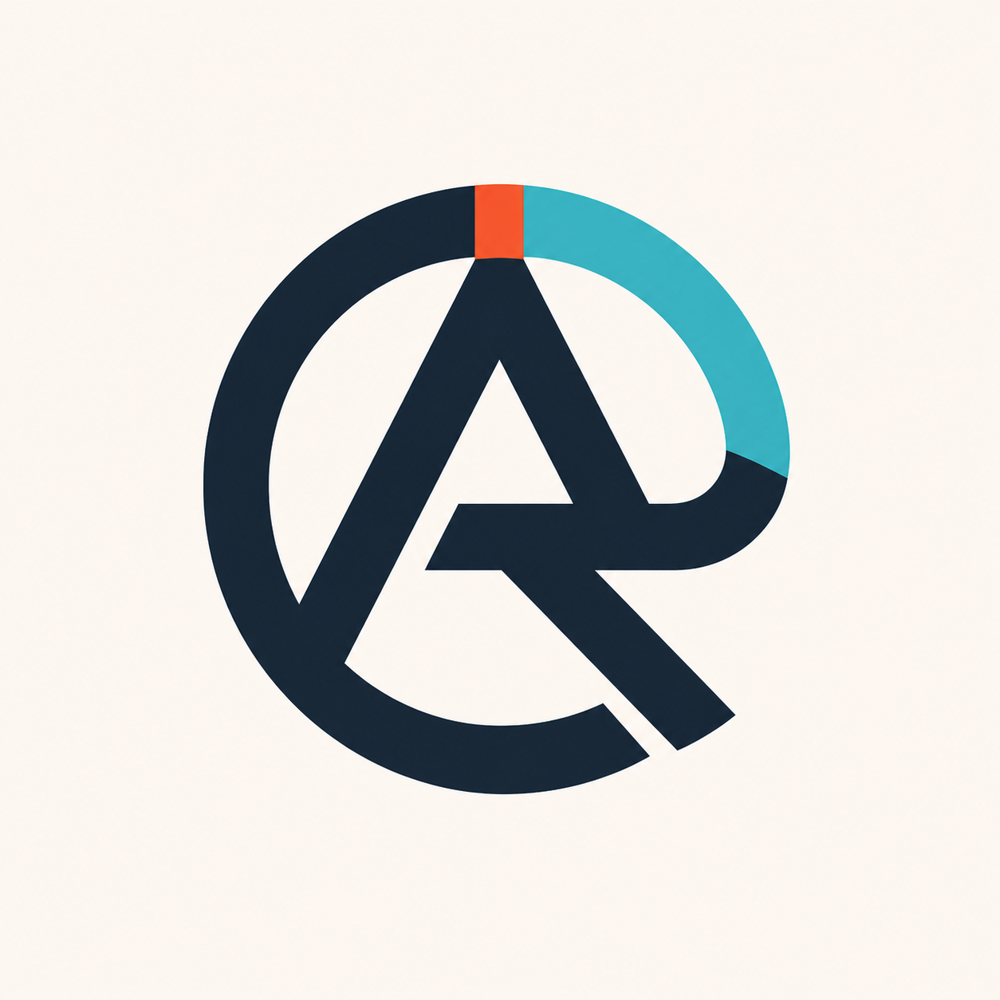
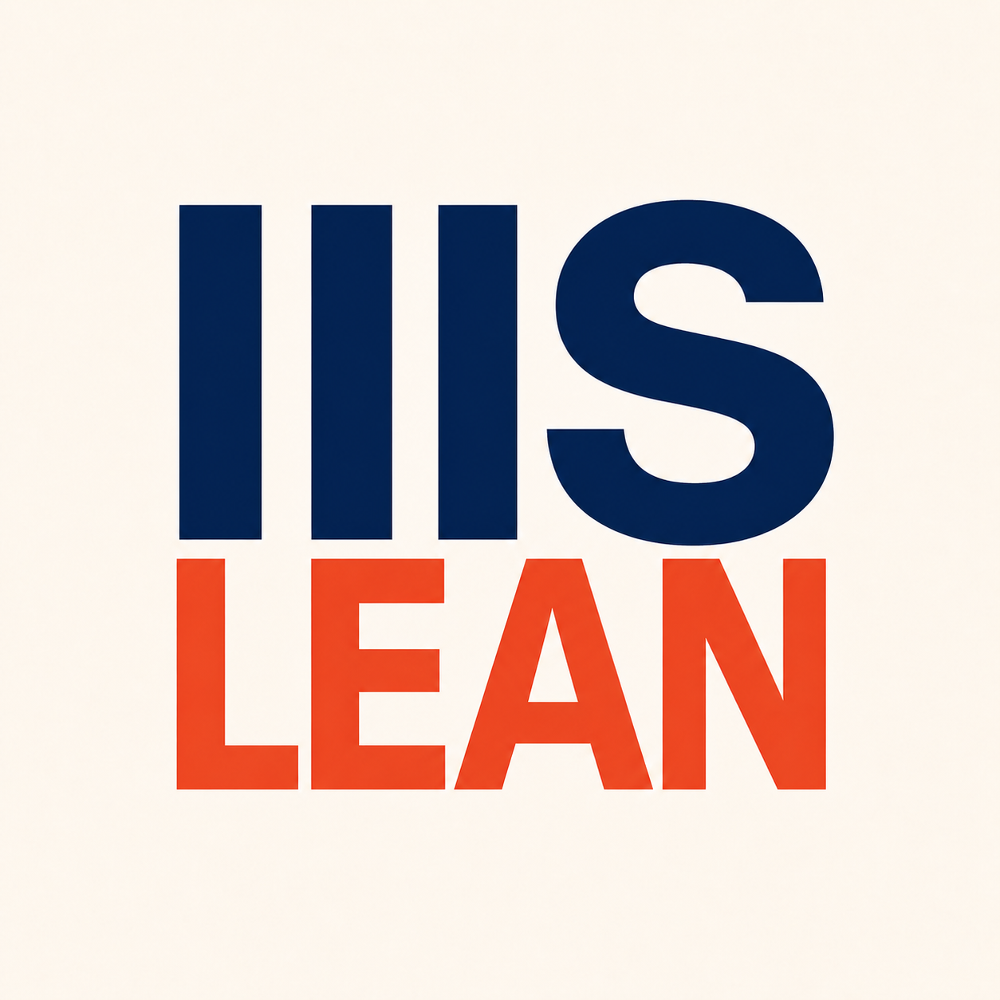

<p align="center">
  
</p>

<h1 align="center">Agent Runtime Kit</h1>

<p align="center">
  <strong>One durable runtime contract for heterogeneous coding Agents and typed workflows.</strong>
</p>

<p align="center">
  <a href="https://www.python.org/">
    
  </a>
  
  <a href="docs/provider-adapters.md">
    
  </a>
  <a href="#bundled-provider-adapters">
    
  </a>
  <a href="docs/agent-context-compaction.md">
    
  </a>
  
</p>

<p align="center">
  <a href="#quick-start">Quick Start</a>
  &middot;
  <a href="#architecture">Architecture</a>
  &middot;
  <a href="docs/README.md">Documentation</a>
  &middot;
  <a href="docs/provider-adapters.md">Provider SPI</a>
  &middot;
  <a href="docs/runtime-observation.md">Observation</a>
  &middot;
  <a href="https://github.com/iiis-lean/lean-constellation">Lean Constellation</a>
</p>

Agent Runtime Kit (ARK) is a lightweight Python framework for applications
that need isolated Agent Homes, durable provider sessions, typed Flow/Step
orchestration, bounded scheduling, normalized observation, and stable
snapshot/restore.

ARK does not impose a business domain or pretend that every Agent backend is
the same. It defines one neutral upper contract, preserves provider evidence,
and makes unsupported semantics explicit.

<table>
  <tr>
    <td width="33%" valign="top">
      <strong>Provider-Neutral Agents</strong><br><br>
      Assemble isolated Homes, start and resume sessions, interrupt, fork,
      inspect context, query turns, and normalize results across adapters.
    </td>
    <td width="33%" valign="top">
      <strong>Typed Orchestration</strong><br><br>
      Build application-defined Flow and Step state machines with asynchronous
      execution, callbacks, submissions, pause gates, and bounded scheduling.
    </td>
    <td width="33%" valign="top">
      <strong>Restorable State</strong><br><br>
      Keep schema-v3 truth, exact session/artifact locators, provider manifests,
      snapshots, indexes, traces, and recovery rules under one runtime root.
    </td>
  </tr>
</table>

## What ARK Owns

| Runtime surface | Included capabilities |
| --- | --- |
| **Agent definition** | Code-defined AgentTypes, instructions, start/continuation prompts, completion checks, and auto-continue policy |
| **Home assembly** | Base/override configuration, environment requirements, auth references, MCP servers, skills, and provider-specific projection |
| **Agent lifecycle** | Create, start/resume, wait, interrupt, session-only fork, close, reconcile, inspect status, and query offline artifacts |
| **Normalized evidence** | Results, backend/model identity, usage, context, turns, tool activity, session locators, artifact locators, and provider details |
| **Workflow runtime** | Typed Flow/Step truth, registries, asynchronous execution, child Flows, callbacks, accepted submissions, and terminal handoff |
| **Scheduling** | Separate Flow advancement and Step-start queues, concurrency limits, pause gates, numeric bounds, and semantic run leases |
| **Persistence** | JSON truth, rebuildable SQLite indexes, provider Artifact Manifests, scope/runtime snapshots, restore, traces, and reports |
| **MCP integration** | Flow/Step/Agent runtime identity and guarded submission helpers for application-owned tools |

## Architecture

```text
Embedding application
  business services · AgentTypes · Flows · Steps · MCP/Admin surfaces
                              │
                              ▼
                         ARKServices
  ┌──────────────────────────────────────────────────────────────┐
  │ AgentService            Provider registry · Homes · sessions │
  │ FlowService             Flow truth · lifecycle · children    │
  │ StepService             asynchronous Step execution          │
  │ RuntimeScheduleService  queues · limits · pause · leases     │
  │ AgentSnapshotService    manifests · scope/runtime restore    │
  └──────────────────────────────────────────────────────────────┘
                              │
          ┌───────────┬───────┼──────────┬──────────────┐
          ▼           ▼       ▼          ▼              ▼
        Codex      Claude     Pi    OpenAI Agents    OpenCode
```

The shared `ARKServices` container carries framework services, while
`AppServices` carries the embedding application's domain services. Runtime
contexts expose both as `ctx.ark` and `ctx.app`, preserving the boundary
between reusable mechanics and application policy.

### One Agent lifecycle, provider-owned evidence

```text
AgentType + HomeSpec
        │
        ▼
Provider Home renderer ──► isolated Home + capability resolution
        │
        ▼
Runtime adapter ──► RunHandle ──► normalized status/result/usage
        │                              │
        └── provider session/artifacts ┘
                         │
                         ▼
              query · compact · snapshot
```

Provider capabilities are resolved from the exact Home and backend. ARK fails
closed for unsupported operations instead of silently substituting a weaker or
different semantic.

## Bundled Provider Adapters

| Provider | Integration | Snapshot/context boundary |
| --- | --- | --- |
| **Codex** | OpenAI Codex Python SDK and isolated Codex Home | Provider rollout JSONL, normalized queries, native compact evidence |
| **Claude Code** | Claude Agent SDK `0.2.124` and Claude Code CLI | Declared session transcript artifacts; fork is session-only, not workspace undo |
| **Pi** | `@earendil-works/pi-coding-agent` `0.80.10` JSONL RPC | Agent-owned session artifacts and compaction; prepared Node runtime for MCP projection |
| **OpenAI Agents** | `openai-agents` `0.18.3`, Responses or Chat Completions | Application-owned Agent factory, durable SQLite sessions, endpoint-dependent compaction |
| **OpenCode** | External `opencode` `1.18.4` executable and isolated server | Isolated SQLite/session state and model-backed compact when supported |

Model identity is independent of provider type. Results retain normalized
backend/model/endpoint fields and provider-specific evidence without binding
the upper runtime contract to one API protocol.

Interactive approval/input requests have reserved neutral extension points,
but ARK does not yet provide a complete `NEEDS_INPUT` service lifecycle.

## Flow and Step Runtime

```text
FlowRequest
  └─► FlowService.start_flow(...)
        └─► scheduler advances Flow
              └─► Flow creates Step
                    └─► StepService executes asynchronously
                          └─► Flow consumes terminal Step result
                                ├─► complete / fail / wait
                                ├─► create another Step
                                └─► dispatch a child Flow
```

For `AgentStep`, ARK creates or reuses a role-bound Agent, injects runtime
identity, optionally inspects/compacts existing context, starts or resumes the
provider session, waits for an accepted typed submission with bounded
auto-continue, and converts it into terminal Step truth.

Applications own their MCP tools and permissions. ARK validates caller
identity and Step binding but does not define domain ToolViews.

## Quick Start

ARK requires Python 3.11 or newer:

```bash
python -m pip install -e .
```

Install development or SDK-backed provider extras when needed:

```bash
python -m pip install -e '.[dev]'
python -m pip install -e '.[claude]'
python -m pip install -e '.[openai-agents]'
```

Provider CLIs, model credentials, and application-owned Node/Python
dependencies stay external. ARK renders isolated Homes but does not mutate the
user's shared provider Home or install subprocess dependencies at runtime.

<details>
<summary><strong>Minimal runtime assembly</strong></summary>

```python
from pathlib import Path

from agent_runtime_kit.agent.service import AgentService
from agent_runtime_kit.agent.snapshots import AgentSnapshotService
from agent_runtime_kit.flow import (
    FlowService,
    FlowTypeRegistry,
    RuntimeScheduleService,
    StepService,
    StepTypeRegistry,
)
from agent_runtime_kit.runtime import ARKServices, AppServices, RuntimePauseController

runtime_root = Path(".agent_runtime")
ark = ARKServices(pause_controller=RuntimePauseController())
app = AppServices()  # Replace with an application-specific subclass.

flow_types = FlowTypeRegistry()
step_types = StepTypeRegistry()
# flow_types.register(MyFlow)
# step_types.register(MyStep)

agent_service = AgentService(runtime_root, ark_services=ark, app_services=app)
FlowService(
    runtime_root,
    flow_registry=flow_types,
    step_registry=step_types,
    ark_services=ark,
    app_services=app,
)
StepService(
    runtime_root,
    step_registry=step_types,
    ark_services=ark,
    app_services=app,
)
RuntimeScheduleService(ark_services=ark, app_services=app)
AgentSnapshotService(
    runtime_root,
    store=agent_service.store,
    agent_service=agent_service,
    ark_services=ark,
    app_services=app,
)
```

Concrete AgentType, Flow, Step, provider registration, Home, and MCP assembly
remain application responsibilities. Tested examples live under
`tests/integration/`.

</details>

## Persistence and Recovery

```text
.agent_runtime/
├── homes/                 # isolated provider Homes and Home index
├── providers/             # provider-owned per-Agent runtime data
├── scopes/                # scope-owned Agent, Flow, and Step truth
├── index/global.sqlite    # rebuildable global index
├── snapshots/
│   ├── scopes/
│   └── runtime/
└── reports/               # optional persisted trace reports
```

Schema-v3 JSON records and provider-native artifacts named by each Artifact
Manifest are authoritative restorable truth. SQLite databases and scheduler
queues are rebuildable unless an adapter explicitly declares a database
authoritative in its manifest.

Observation-only waits distinguish settled terminal, timeout, not-started,
active, and persisted-running-without-runner states. Context inspection and
between-turn compaction are optional capabilities with explicit admission,
completion evidence, failure recovery, and snapshot rules.

## Ecosystem

| Project | Built on ARK for | Repository |
| --- | --- | --- |
| **Lean Constellation** | Multi-repository Lean formalization coordination, Agent workflows, release gates, and operator surfaces | [iiis-lean/lean-constellation](https://github.com/iiis-lean/lean-constellation) |
| **Lean MCP Toolkit** | Application-owned Lean tools consumed through MCP/HTTP ToolViews in the Lean Constellation stack | [iiis-lean/lean-mcp-toolkit](https://github.com/iiis-lean/lean-mcp-toolkit) |

ARK itself remains application-neutral: it does not depend on Lean, define a
web server, own business permissions, or prescribe application workflows.

## Documentation

| Area | Entry point |
| --- | --- |
| Documentation | [Public documentation index](docs/README.md) |
| Provider contract | [Provider adapters and normalized runtime](docs/provider-adapters.md) |
| Runtime observation | [Step terminal and Agent status waits](docs/runtime-observation.md) |
| Context | [Inspection and compaction](docs/agent-context-compaction.md) |
| Claude Code | [Claude Code provider](docs/claude-code-provider.md) |
| Pi | [Pi provider](docs/pi-provider.md) |
| OpenAI Agents | [OpenAI Agents provider](docs/openai-agents-provider.md) |
| OpenCode | [OpenCode adapter](docs/provider-adapters.md#opencode-adapter) |

## Framework Boundaries

ARK intentionally does not provide application-specific tools, ToolViews,
authorization, business Flow definitions, domain services, an Admin/web
server, a process supervisor, or distributed multi-process scheduling. These
belong to the embedding application.

## Testing

Run deterministic unit and integration coverage with:

```bash
python -m pytest -q tests/unit tests/integration
```

Real provider tests live under `tests/real/` and require explicitly configured
CLIs, Homes, credentials, and opt-in environment gates.

<p align="center">
  <a href="https://github.com/iiis-lean">
    
  </a>
</p>
